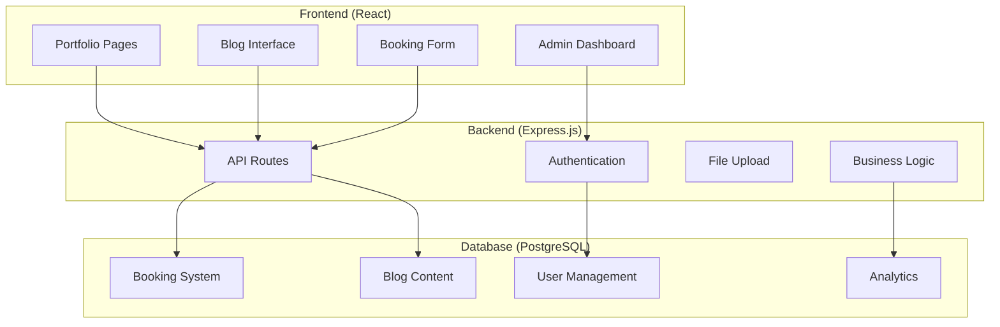
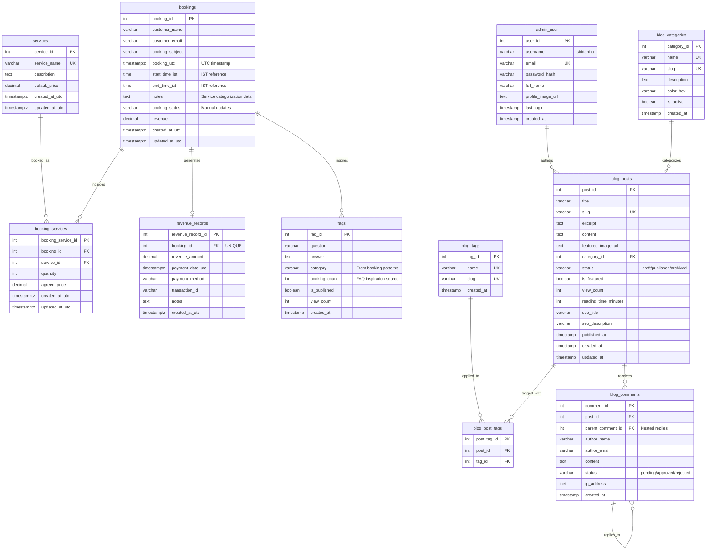
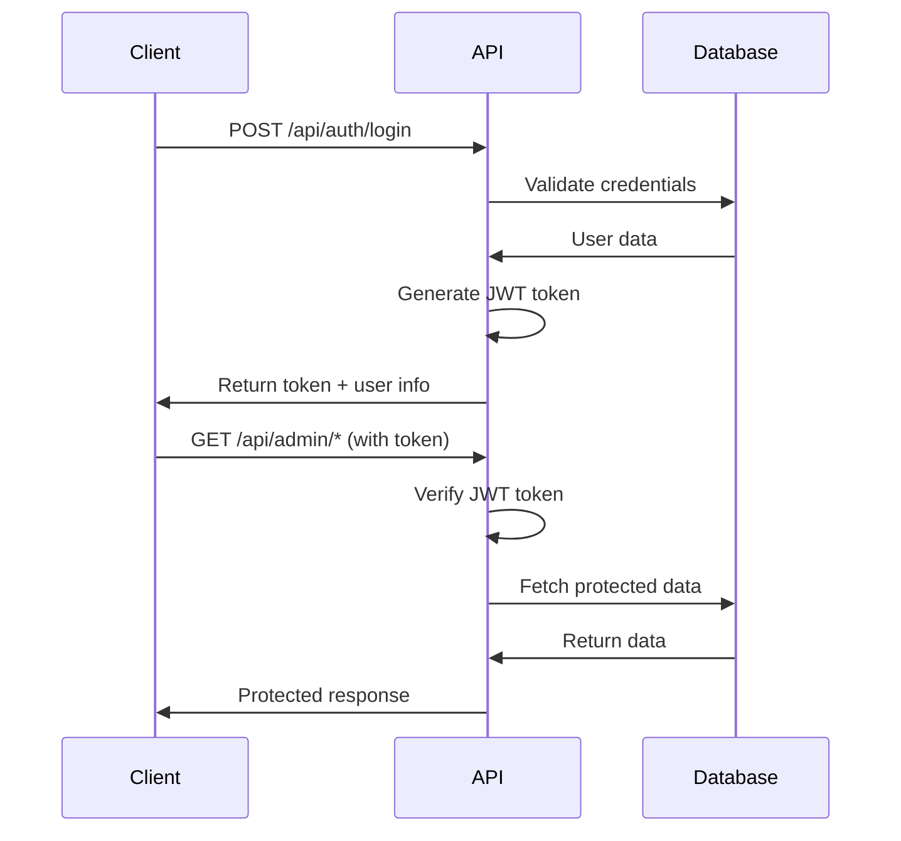
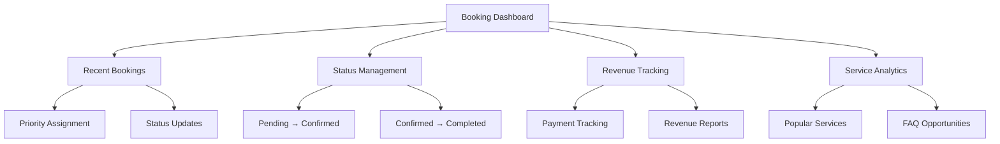
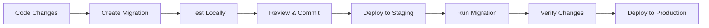
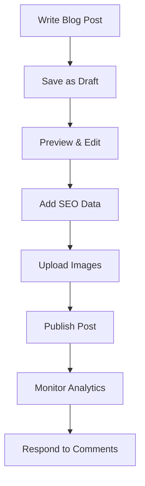

# MPF Portfolio & Blog System

> **Personal Portfolio with Integrated Blogging Platform**  
> Built by Yerabati Venkata Balakrishna Siddartha - QA Manager & Tech Consultant

[](https://nodejs.org/)
[](https://reactjs.org/)
[](https://postgresql.org/)
[](https://expressjs.com/)

## 🎯 Project Overview

MPF is a sophisticated personal portfolio website with integrated booking system and blog platform. The system manages client bookings with advanced UTC/IST time handling, revenue tracking, and provides a content management system for professional blogging.

### ✨ Key Features
- 📅 **Advanced Booking System** - UTC/IST time zones, revenue tracking, service management
- ✍️ **Personal Blog Platform** - Single-author CMS with rich text editing
- 📊 **Admin Dashboard** - Booking analytics, content management, FAQ generation
- 🔐 **Secure Authentication** - JWT-based admin access
- 📱 **Responsive Design** - Mobile-first React frontend
- 🚀 **Performance Optimized** - Connection pooling, image optimization

## 🏗️ System Architecture



## 🗄️ Database Schema

### Complete Entity Relationship Diagram



### Key Design Decisions

#### 🎯 **Single-Author Blog System**
- **Decision**: One admin user (you) authors all blog content
- **Rationale**: Personal portfolio - maintains consistent voice and quality
- **Benefit**: Simplified permissions, focused content strategy

#### ⏰ **Sophisticated Time Handling**  
- **UTC Storage**: `booking_utc` for accurate cross-timezone scheduling
- **IST Reference**: `start_time_ist` / `end_time_ist` for local context
- **Business Logic**: Supports international clients with timezone clarity

#### 💡 **FAQ Generation from Bookings**
- **Innovation**: Analyze `booking.notes` to identify common patterns
- **Automation**: Build knowledge base from real client questions
- **Scalability**: Reduce repetitive consultation requests

## 🛠️ Technology Stack

### Frontend
- **React 19.x** - Modern UI framework with hooks
- **Styled Components** - CSS-in-JS styling
- **React Router** - Client-side routing
- **Context API** - State management
- **CKEditor** - Rich text editing for blog posts

### Backend  
- **Node.js 18.x** - JavaScript runtime
- **Express.js 4.x** - Web application framework
- **PostgreSQL 15.x** - Primary database
- **JWT** - Authentication & authorization
- **Multer** - File upload handling
- **Joi** - Input validation

### DevOps & Tools
- **Raw SQL** - Direct database queries (no ORM)
- **Custom Migrations** - Database version control
- **Winston Logging** - Comprehensive logging system
- **Helmet** - Security middleware
- **CORS** - Cross-origin resource sharing

## 🚀 Quick Start

### Prerequisites
- Node.js 18.x or higher
- PostgreSQL 15.x or higher
- npm or yarn package manager

### Installation

1. **Clone the repository**
   ```bash
   git clone https://github.com/SiddarthaYVBK/mpf-portfolio.git
   cd mpf-portfolio
   ```

2. **Install dependencies**
   ```bash
   # Frontend dependencies
   npm install
   
   # Backend dependencies
   cd server
   npm install
   ```

3. **Environment setup**
   ```bash
   # Copy environment template
   cp server/.env.example server/.env
   
   # Configure your database credentials
   nano server/.env
   ```

4. **Database setup**
   ```bash
   # Run migrations
   cd server
   npm run migrate
   
   # Seed initial data
   npm run seed
   ```

5. **Start development servers**
   ```bash
   # Start backend (Terminal 1)
   cd server
   npm run dev
   
   # Start frontend (Terminal 2)
   cd ..
   npm start
   ```

6. **Access the application**
   - **Portfolio**: http://localhost:3000
   - **Admin Panel**: http://localhost:3000/admin
   - **API Health**: http://localhost:5000/health

## 📚 API Documentation

### Authentication Flow


### Core API Endpoints

#### Public Endpoints
```bash
# Blog content (public access)
GET  /api/blog/posts              # List published posts
GET  /api/blog/posts/:slug        # Get single post
GET  /api/blog/categories         # List categories
GET  /api/blog/tags              # List tags

# Booking system (public access)  
POST /api/bookings               # Create new booking
GET  /api/services               # List available services
```

#### Protected Endpoints (Admin Only)
```bash
# Authentication
POST /api/auth/login             # Admin login
POST /api/auth/logout            # Logout
GET  /api/auth/profile           # Get current user

# Blog management
POST   /api/blog/posts           # Create new post
PUT    /api/blog/posts/:id       # Update post
DELETE /api/blog/posts/:id       # Delete post
POST   /api/blog/upload          # Upload images

# Booking management
GET  /api/bookings               # List all bookings
PUT  /api/bookings/:id           # Update booking status
GET  /api/admin/dashboard        # Dashboard analytics
```

## 📊 Admin Dashboard Features

### Booking Management


### Content Management
- ✍️ **Blog Post Editor** - Rich text editing with image uploads
- 📂 **Category Management** - Organize content by topics
- 🏷️ **Tag System** - Flexible content tagging
- 💬 **Comment Moderation** - Approve/reject visitor comments
- 📈 **Analytics Dashboard** - Post views, engagement metrics

### Business Intelligence
- 📊 **Booking Trends** - Identify popular services and time slots
- 💰 **Revenue Analysis** - Track income patterns and growth
- ❓ **FAQ Generation** - Build knowledge base from booking inquiries
- 📝 **Message Analysis** - Categorize client requests automatically

## 🔒 Security Features

### Authentication & Authorization
- **JWT Tokens** - Secure session management
- **Password Hashing** - bcrypt encryption
- **Role-Based Access** - Admin-only protected routes
- **Rate Limiting** - API abuse prevention

### Data Protection
- **Input Validation** - Joi schema validation
- **SQL Injection Prevention** - Parameterized queries
- **CORS Configuration** - Cross-origin request control
- **Helmet Security** - HTTP header protection

### File Upload Security
- **File Type Validation** - Allowed extensions only
- **File Size Limits** - Prevent large uploads
- **Secure Storage** - Protected upload directory
- **Image Processing** - Automatic optimization

## 📁 Project Structure

```
mpf/
├── 📄 README.md                 # This file
├── 📄 package.json              # Frontend dependencies
├── 📁 public/                   # Static assets
├── 📁 src/                      # React frontend
│   ├── 📁 api/                  # API client
│   ├── 📁 components/           # React components
│   ├── 📁 pages/                # Page components
│   ├── 📁 context/              # React context
│   ├── 📁 hooks/                # Custom hooks
│   ├── 📁 services/             # Business logic
│   └── 📁 data/                 # Static data files
├── 📁 server/                   # Backend API
│   ├── 📄 index.js              # Express server
│   ├── 📄 config.js             # Configuration
│   ├── 📄 db.js                 # Database connection
│   ├── 📁 models/               # Database models
│   ├── 📁 routes/               # API routes
│   ├── 📁 middleware/           # Express middleware
│   ├── 📁 migrations/           # Database migrations
│   ├── 📁 utils/                # Utility functions
│   └── 📁 uploads/              # File storage
├── 📁 docs/                     # Documentation
│   ├── 📄 database-design.md    # Database documentation
│   ├── 📄 api-documentation.md  # API reference
│   └── 📄 deployment-guide.md   # Deployment instructions
└── 📁 tests/                    # Test suites
    ├── 📁 unit/                 # Unit tests
    ├── 📁 integration/          # Integration tests
    └── 📁 e2e/                  # End-to-end tests
```

## 🚦 Development Workflow

### Database Migrations


### Content Publishing Flow


## 📈 Performance Considerations

### Database Optimization
- **Connection Pooling** - Efficient database connections
- **Strategic Indexing** - Optimized query performance
- **Query Optimization** - Hand-tuned SQL queries
- **Raw SQL Approach** - Maximum performance control

### Frontend Performance
- **Code Splitting** - Lazy loading of components
- **Image Optimization** - Automatic image compression
- **Caching Strategy** - Smart data caching
- **Bundle Optimization** - Minimized JavaScript bundles

## 🤝 Contributing

This is a personal portfolio project, but suggestions and feedback are welcome!

### Reporting Issues
- Use GitHub Issues for bug reports
- Include steps to reproduce
- Provide environment details

### Feature Requests
- Discuss major changes via GitHub Discussions
- Consider backward compatibility
- Focus on personal portfolio use cases

## 📄 License

This project is licensed under the MIT License - see the [LICENSE](LICENSE) file for details.

## 👨‍💻 About the Developer

**Yerabati Venkata Balakrishna Siddartha**
- 🎯 QA Manager & Tech Consultant
- 💼 14+ years in Software Testing & Quality Assurance
- 🚀 Ex-Flynas, Specialized in DevOps & Test Automation
- 📧 [Contact for Consultations](mailto:your-email@domain.com)

### Professional Services
- 🔍 **QA Consultation** - Process optimization & best practices
- 🤖 **Test Automation** - Framework setup & implementation  
- 💼 **Career Mentoring** - Tech career guidance & mock interviews
- ⚙️ **DevOps Implementation** - CI/CD pipeline setup

---

**⭐ Star this repository if you find it helpful!**

*Last updated: May 2025*