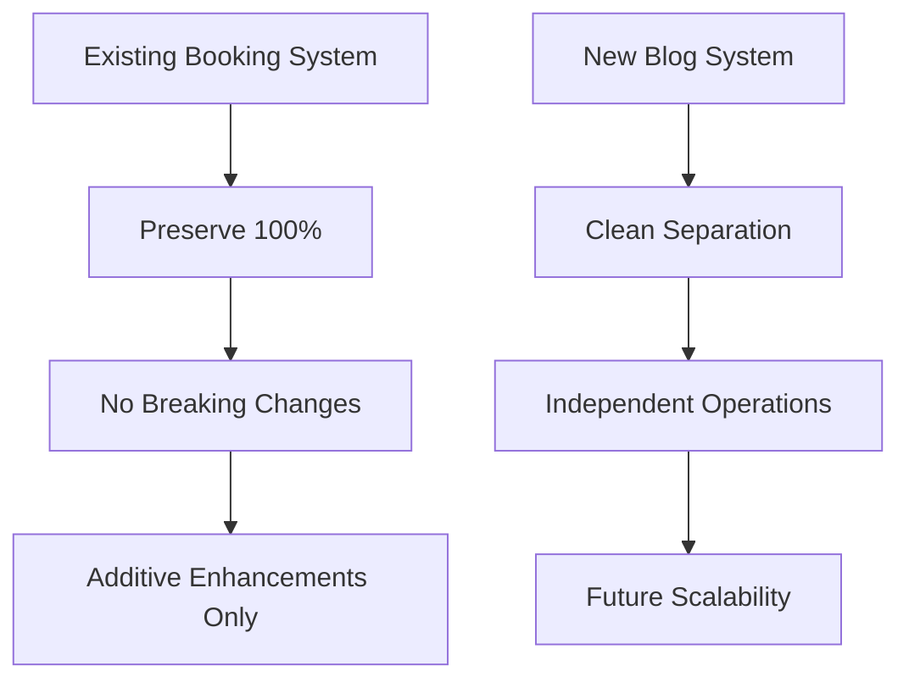
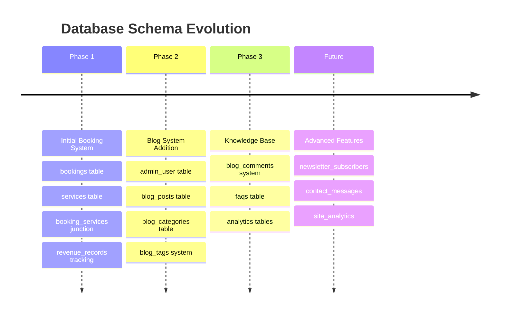
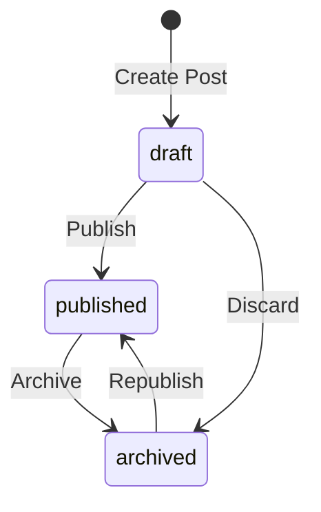
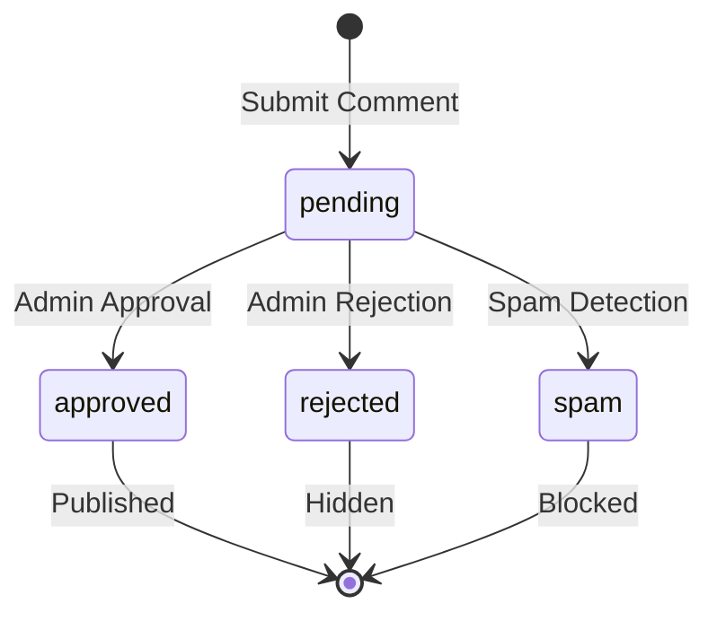
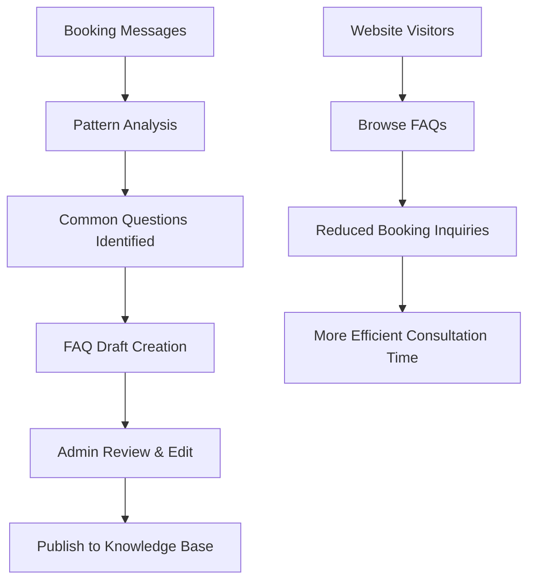
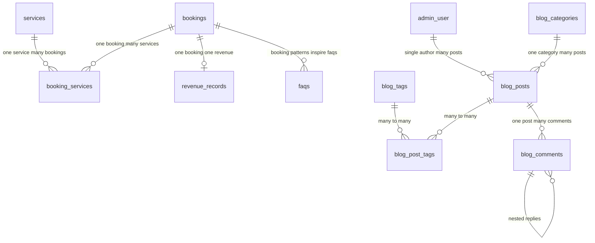

# MPF Database Design Documentation

> **Comprehensive database schema and design decisions for the MPF Portfolio & Blog System**

## 📋 Table of Contents

1. [Overview](#overview)
2. [Design Philosophy](#design-philosophy)
3. [Schema Evolution](#schema-evolution)
4. [Table Specifications](#table-specifications)
5. [Relationships & Constraints](#relationships--constraints)
6. [Indexing Strategy](#indexing-strategy)
7. [Migration System](#migration-system)
8. [Performance Considerations](#performance-considerations)
9. [Security Implementation](#security-implementation)
10. [Future Enhancements](#future-enhancements)

## 🎯 Overview

The MPF database is designed as a **dual-purpose system** supporting both a sophisticated booking management platform and a personal blog content management system. The architecture prioritizes **data integrity**, **performance**, and **maintainability** while preserving existing business-critical booking functionality.

### Core Statistics
- **Tables**: 12 primary tables
- **Relationships**: 15+ foreign key constraints
- **Indexes**: 20+ performance-optimized indexes
- **Time Zones**: UTC storage with IST reference support
- **Authentication**: Single admin user with JWT integration

## 🏗️ Design Philosophy

### 1. **Preservation First**


**Principle**: The existing booking system represents proven business logic that generates revenue. Any database changes must be purely additive to avoid disrupting established workflows.

### 2. **Time Zone Sophistication**
```sql
-- Current sophisticated approach (preserved)
booking_utc TIMESTAMP WITH TIME ZONE     -- Universal time storage
start_time_ist TIME WITHOUT TIME ZONE    -- Local context for India
end_time_ist TIME WITHOUT TIME ZONE      -- Business hour reference
```

**Rationale**: International consulting requires precise time handling. The existing UTC/IST dual approach prevents scheduling conflicts and supports global client base.

### 3. **Single Author Architecture**


**Decision**: Blog system designed for one author (you) rather than multi-user CMS. This simplifies permissions, ensures content consistency, and aligns with personal branding strategy.

## 📅 Schema Evolution

### Migration Timeline



### Version History
- **v1.0** - Initial booking system (existing)
- **v2.0** - Blog system integration (current implementation)
- **v2.1** - FAQ generation from booking patterns (planned)
- **v3.0** - Advanced analytics and reporting (future)

## 📊 Table Specifications

### 🏢 **Booking System Tables** (Existing - Preserved)

#### `bookings` - Core Business Logic
```sql
CREATE TABLE bookings (
    booking_id SERIAL PRIMARY KEY,
    customer_name VARCHAR(255) NOT NULL,
    customer_email VARCHAR(255),
    booking_subject VARCHAR(255) NOT NULL,
    booking_utc TIMESTAMP WITH TIME ZONE NOT NULL,
    start_time_ist TIME WITHOUT TIME ZONE,
    end_time_ist TIME WITHOUT TIME ZONE,
    notes TEXT,                              -- KEY: Service categorization
    booking_status VARCHAR(50) DEFAULT 'Pending',
    revenue DECIMAL(10, 2),
    created_at_utc TIMESTAMP WITH TIME ZONE DEFAULT CURRENT_TIMESTAMP,
    updated_at_utc TIMESTAMP WITH TIME ZONE DEFAULT CURRENT_TIMESTAMP
);
```

**Business Rules**:
- `booking_utc` must be in future (booking constraint)
- `notes` field contains critical service categorization data
- `booking_status` values: `Pending`, `Confirmed`, `Completed`, `Cancelled`
- Revenue tracking integrated for financial analysis

#### `services` - Service Catalog
```sql
CREATE TABLE services (
    service_id SERIAL PRIMARY KEY,
    service_name VARCHAR(255) UNIQUE NOT NULL,
    description TEXT,
    default_price DECIMAL(10, 2),
    created_at_utc TIMESTAMP WITH TIME ZONE DEFAULT CURRENT_TIMESTAMP,
    updated_at_utc TIMESTAMP WITH TIME ZONE DEFAULT CURRENT_TIMESTAMP
);
```

**Predefined Services**:
- QA Consultation ($150/hour)
- Career Mentoring ($100/hour)  
- Test Automation Setup ($200/1.5 hours)
- Mock Interview ($75/45 minutes)
- Code Review ($125/hour)

#### `booking_services` - Many-to-Many Junction
```sql
CREATE TABLE booking_services (
    booking_service_id SERIAL PRIMARY KEY,
    booking_id INTEGER REFERENCES bookings(booking_id),
    service_id INTEGER REFERENCES services(service_id),
    quantity INTEGER DEFAULT 1,
    agreed_price DECIMAL(10, 2),
    created_at_utc TIMESTAMP WITH TIME ZONE DEFAULT CURRENT_TIMESTAMP,
    updated_at_utc TIMESTAMP WITH TIME ZONE DEFAULT CURRENT_TIMESTAMP,
    UNIQUE (booking_id, service_id)
);
```

**Business Logic**: Supports composite bookings (multiple services per booking) with negotiated pricing flexibility.

#### `revenue_records` - Financial Tracking
```sql
CREATE TABLE revenue_records (
    revenue_record_id SERIAL PRIMARY KEY,
    booking_id INTEGER REFERENCES bookings(booking_id) UNIQUE,
    revenue_amount DECIMAL(10, 2) NOT NULL,
    payment_date_utc TIMESTAMP WITH TIME ZONE,
    payment_method VARCHAR(100),
    transaction_id VARCHAR(255),
    notes TEXT,
    created_at_utc TIMESTAMP WITH TIME ZONE DEFAULT CURRENT_TIMESTAMP
);
```

**Features**:
- One-to-one with bookings (each booking = one revenue record)
- Payment method tracking (PayPal, Bank Transfer, etc.)
- Transaction ID storage for reconciliation

### ✍️ **Blog System Tables** (New Addition)

#### `admin_user` - Single Author Authentication
```sql
CREATE TABLE admin_user (
    user_id SERIAL PRIMARY KEY,
    username VARCHAR(50) UNIQUE NOT NULL,        -- 'siddartha'
    email VARCHAR(255) UNIQUE NOT NULL,
    password_hash VARCHAR(255) NOT NULL,         -- bcrypt hashed
    full_name VARCHAR(255),                      -- Display name
    profile_image_url TEXT,
    bio TEXT,
    is_active BOOLEAN DEFAULT true,
    last_login TIMESTAMP,
    created_at TIMESTAMP DEFAULT CURRENT_TIMESTAMP,
    updated_at TIMESTAMP DEFAULT CURRENT_TIMESTAMP
);
```

**Security Features**:
- bcrypt password hashing (cost factor: 12)
- JWT token generation for session management
- Last login tracking for security monitoring
- Account deactivation capability

#### `blog_posts` - Content Management
```sql
CREATE TABLE blog_posts (
    post_id SERIAL PRIMARY KEY,
    title VARCHAR(255) NOT NULL,
    slug VARCHAR(255) UNIQUE NOT NULL,           -- URL-friendly
    excerpt TEXT,                                -- Meta description
    content TEXT NOT NULL,                       -- Main content
    featured_image_url TEXT,
    category_id INTEGER REFERENCES blog_categories(category_id),
    status VARCHAR(20) DEFAULT 'draft',          -- draft/published/archived
    is_featured BOOLEAN DEFAULT false,           -- Homepage highlight
    view_count INTEGER DEFAULT 0,               -- Analytics
    reading_time_minutes INTEGER,               -- Auto-calculated
    seo_title VARCHAR(60),                      -- <title> tag
    seo_description VARCHAR(160),               -- Meta description
    published_at TIMESTAMP,
    created_at TIMESTAMP DEFAULT CURRENT_TIMESTAMP,
    updated_at TIMESTAMP DEFAULT CURRENT_TIMESTAMP
);
```

**Content Workflow**:


**SEO Features**:
- Custom SEO titles and descriptions
- Automatic reading time calculation
- URL slug optimization
- Featured post highlighting

#### `blog_categories` - Content Organization
```sql
CREATE TABLE blog_categories (
    category_id SERIAL PRIMARY KEY,
    name VARCHAR(100) UNIQUE NOT NULL,
    slug VARCHAR(100) UNIQUE NOT NULL,
    description TEXT,
    color_hex VARCHAR(7) DEFAULT '#0070f3',     -- Visual theming
    is_active BOOLEAN DEFAULT true,
    created_at TIMESTAMP DEFAULT CURRENT_TIMESTAMP
);
```

**Predefined Categories**:
- Quality Assurance (#FF6B6B)
- Test Automation (#4ECDC4)
- Career Development (#45B7D1)
- DevOps (#96CEB4)
- Industry Insights (#FECA57)

#### `blog_tags` - Flexible Tagging
```sql
CREATE TABLE blog_tags (
    tag_id SERIAL PRIMARY KEY,
    name VARCHAR(50) UNIQUE NOT NULL,
    slug VARCHAR(50) UNIQUE NOT NULL,
    created_at TIMESTAMP DEFAULT CURRENT_TIMESTAMP
);
```

**Many-to-Many Relationship**:
```sql
CREATE TABLE blog_post_tags (
    post_tag_id SERIAL PRIMARY KEY,
    post_id INTEGER REFERENCES blog_posts(post_id) ON DELETE CASCADE,
    tag_id INTEGER REFERENCES blog_tags(tag_id) ON DELETE CASCADE,
    UNIQUE(post_id, tag_id)
);
```

#### `blog_comments` - Community Engagement
```sql
CREATE TABLE blog_comments (
    comment_id SERIAL PRIMARY KEY,
    post_id INTEGER REFERENCES blog_posts(post_id) ON DELETE CASCADE,
    parent_comment_id INTEGER REFERENCES blog_comments(comment_id), -- Nested replies
    author_name VARCHAR(255) NOT NULL,
    author_email VARCHAR(255) NOT NULL,
    author_website VARCHAR(255),
    content TEXT NOT NULL,
    status VARCHAR(20) DEFAULT 'pending',       -- pending/approved/rejected/spam
    ip_address INET,                            -- Security tracking
    user_agent TEXT,                            -- Browser fingerprinting
    created_at TIMESTAMP DEFAULT CURRENT_TIMESTAMP
);
```

**Moderation Workflow**:


### 💡 **Knowledge Base Tables** (Future Enhancement)

#### `faqs` - Intelligent FAQ Generation
```sql
CREATE TABLE faqs (
    faq_id SERIAL PRIMARY KEY,
    question VARCHAR(500) NOT NULL,
    answer TEXT NOT NULL,
    category VARCHAR(100),                      -- Based on service types
    booking_count INTEGER DEFAULT 0,           -- Inspiration source tracking
    is_published BOOLEAN DEFAULT false,
    view_count INTEGER DEFAULT 0,
    display_order INTEGER DEFAULT 0,
    created_at TIMESTAMP DEFAULT CURRENT_TIMESTAMP,
    updated_at TIMESTAMP DEFAULT CURRENT_TIMESTAMP
);
```

**FAQ Generation Strategy**:


## 🔗 Relationships & Constraints

### Primary Relationships



### Foreign Key Constraints

#### Booking System Constraints
```sql
-- Booking services must reference valid bookings and services
ALTER TABLE booking_services 
ADD CONSTRAINT fk_booking_services_booking 
FOREIGN KEY (booking_id) REFERENCES bookings(booking_id) ON DELETE CASCADE;

ALTER TABLE booking_services 
ADD CONSTRAINT fk_booking_services_service 
FOREIGN KEY (service_id) REFERENCES services(service_id) ON DELETE RESTRICT;

-- Revenue records must reference valid bookings (one-to-one)
ALTER TABLE revenue_records 
ADD CONSTRAINT fk_revenue_records_booking 
FOREIGN KEY (booking_id) REFERENCES bookings(booking_id) ON DELETE CASCADE;
```

#### Blog System Constraints
```sql
-- Blog posts must reference valid categories (optional)
ALTER TABLE blog_posts 
ADD CONSTRAINT fk_blog_posts_category 
FOREIGN KEY (category_id) REFERENCES blog_categories(category_id) ON DELETE SET NULL;

-- Comments must reference valid posts
ALTER TABLE blog_comments 
ADD CONSTRAINT fk_blog_comments_post 
FOREIGN KEY (post_id) REFERENCES blog_posts(post_id) ON DELETE CASCADE;

-- Self-referencing for nested comments
ALTER TABLE blog_comments 
ADD CONSTRAINT fk_blog_comments_parent 
FOREIGN KEY (parent_comment_id) REFERENCES blog_comments(comment_i