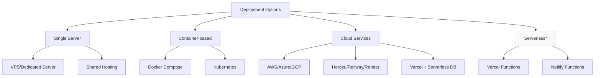
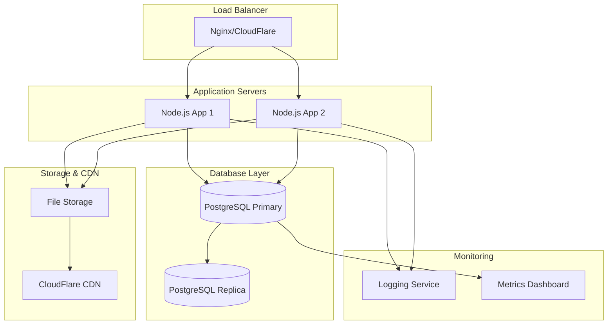

# MPF Deployment Guide

> **Complete deployment instructions for the MPF Portfolio & Blog System**

## 📋 Table of Contents

1. [Deployment Overview](#deployment-overview)
2. [Environment Setup](#environment-setup)
3. [Database Configuration](#database-configuration)
4. [Application Deployment](#application-deployment)
5. [Security Configuration](#security-configuration)
6. [Performance Optimization](#performance-optimization)
7. [Monitoring & Logging](#monitoring--logging)
8. [Backup & Recovery](#backup--recovery)
9. [CI/CD Pipeline](#cicd-pipeline)
10. [Troubleshooting](#troubleshooting)

## 🎯 Deployment Overview

The MPF system can be deployed in multiple configurations depending on your needs and infrastructure preferences.

### Deployment Options



*Serverless option requires API refactoring

### Recommended Architecture

#### Production Architecture


## 🛠️ Environment Setup

### Development Environment

#### Prerequisites
```bash
# Required versions
Node.js >= 18.x
PostgreSQL >= 15.x
npm >= 8.x
Git >= 2.x
```

#### Local Setup
```bash
# Clone repository
git clone https://github.com/SiddarthaYVBK/mpf-portfolio.git
cd mpf-portfolio

# Install dependencies
npm install
cd server && npm install && cd ..

# Environment configuration
cp server/.env.example server/.env
# Edit server/.env with your settings

# Database setup
cd server
npm run migrate
npm run seed

# Start development servers
npm run dev:all  # Starts both frontend and backend
```

### Production Environment

#### Server Requirements
- **CPU**: 2+ cores (4+ recommended)
- **RAM**: 4GB minimum (8GB+ recommended)
- **Storage**: 50GB+ SSD
- **OS**: Ubuntu 20.04 LTS / CentOS 8 / Amazon Linux 2
- **Network**: Minimum 100Mbps connection

#### System Dependencies
```bash
# Ubuntu/Debian
sudo apt update
sudo apt install -y nodejs npm postgresql postgresql-contrib nginx certbot python3-certbot-nginx

# CentOS/RHEL
sudo yum update
sudo yum install -y nodejs npm postgresql postgresql-server nginx certbot python3-certbot-nginx

# Verify installations
node --version  # Should be 18.x+
npm --version   # Should be 8.x+
psql --version  # Should be 15.x+
nginx -v        # Should be 1.18+
```

## 🗄️ Database Configuration

### PostgreSQL Setup

#### Installation & Initial Configuration
```bash
# Initialize PostgreSQL (CentOS/RHEL only)
sudo postgresql-setup initdb
sudo systemctl enable postgresql
sudo systemctl start postgresql

# Create database and user
sudo -u postgres psql

-- In PostgreSQL prompt
CREATE DATABASE mpf_portfolio;
CREATE USER mpf_user WITH ENCRYPTED PASSWORD 'secure_password_here';
GRANT ALL PRIVILEGES ON DATABASE mpf_portfolio TO mpf_user;
ALTER USER mpf_user CREATEDB;  -- For running migrations
\q
```

#### Security Configuration
```bash
# Edit PostgreSQL configuration
sudo nano /etc/postgresql/15/main/postgresql.conf

# Key settings
listen_addresses = 'localhost'          # Security: only local connections
max_connections = 100                   # Adjust based on your needs
shared_buffers = 256MB                  # 25% of RAM for small servers
effective_cache_size = 1GB              # 75% of RAM
work_mem = 4MB                          # Per-connection memory
maintenance_work_mem = 64MB             # Maintenance operations

# Authentication configuration
sudo nano /etc/postgresql/15/main/pg_hba.conf

# Add/modify these lines
local   mpf_portfolio   mpf_user                        md5
host    mpf_portfolio   mpf_user        127.0.0.1/32   md5
host    mpf_portfolio   mpf_user        ::1/128         md5

# Restart PostgreSQL
sudo systemctl restart postgresql
```

#### Database Performance Tuning
```sql
-- Connect as superuser and run these optimizations
sudo -u postgres psql mpf_portfolio

-- Create indexes for performance
CREATE INDEX CONCURRENTLY idx_bookings_created_status 
ON bookings(created_at_utc DESC, booking_status);

CREATE INDEX CONCURRENTLY idx_blog_posts_published_featured 
ON blog_posts(published_at DESC, is_featured) 
WHERE status = 'published';

-- Analyze tables for query optimization
ANALYZE;

-- Set up automatic statistics collection
ALTER SYSTEM SET track_activities = on;
ALTER SYSTEM SET track_counts = on;
ALTER SYSTEM SET track_functions = all;
SELECT pg_reload_conf();
```

### Database Backup Configuration
```bash
# Create backup script
sudo nano /usr/local/bin/mpf-backup.sh

#!/bin/bash
BACKUP_DIR="/var/backups/mpf"
DATE=$(date +%Y%m%d_%H%M%S)
DB_NAME="mpf_portfolio"
DB_USER="mpf_user"

# Create backup directory
mkdir -p $BACKUP_DIR

# Create compressed backup
pg_dump -h localhost -U $DB_USER -d $DB_NAME -Fc > $BACKUP_DIR/mpf_backup_$DATE.dump

# Keep only last 7 days of backups
find $BACKUP_DIR -name "mpf_backup_*.dump" -mtime +7 -delete

# Log backup completion
echo "$(date): Backup completed - mpf_backup_$DATE.dump" >> /var/log/mpf-backup.log

# Make script executable
sudo chmod +x /usr/local/bin/mpf-backup.sh

# Add to crontab for daily backups at 2 AM
sudo crontab -e
0 2 * * * /usr/local/bin/mpf-backup.sh
```

## 🚀 Application Deployment

### Single Server Deployment (Recommended for Start)

#### Step 1: Server Preparation
```bash
# Create application user
sudo useradd -m -s /bin/bash mpf
sudo usermod -aG sudo mpf  # Add sudo privileges if needed

# Create application directories
sudo mkdir -p /opt/mpf
sudo chown mpf:mpf /opt/mpf

# Switch to application user
sudo su - mpf
```

#### Step 2: Application Setup
```bash
# Clone and setup application
cd /opt/mpf
git clone https://github.com/SiddarthaYVBK/mpf-portfolio.git .

# Install dependencies
npm install
cd server && npm install && cd ..

# Build frontend for production
npm run build

# Copy environment configuration
cp server/.env.example server/.env
nano server/.env  # Configure production settings
```

#### Step 3: Environment Variables Configuration
```bash
# server/.env - Production Configuration
NODE_ENV=production
PORT=5000

# Database Configuration
DB_HOST=localhost
DB_PORT=5432
DB_NAME=mpf_portfolio
DB_USER=mpf_user
DB_PASSWORD=your_secure_password_here

# Security Configuration
JWT_SECRET=your_super_long_random_jwt_secret_minimum_32_characters
ADMIN_EMAIL=your_admin@email.com
ADMIN_PASSWORD=your_very_secure_admin_password

# File Upload Configuration
UPLOAD_PATH=/opt/mpf/uploads
MAX_FILE_SIZE=5242880
ALLOWED_FILE_TYPES=jpg,jpeg,png,gif,webp

# Email Configuration (Optional)
SMTP_HOST=smtp.gmail.com
SMTP_PORT=587
SMTP_USER=your_email@gmail.com
SMTP_PASS=your_app_password

# Frontend URL
FRONTEND_URL=https://your-domain.com

# Public URL for file serving
PUBLIC_URL=https://your-domain.com
```

#### Step 4: Database Migration
```bash
# Run database migrations
cd /opt/mpf/server
npm run migrate

# Verify database setup
npm run db:health
```

#### Step 5: Process Management with PM2
```bash
# Install PM2 globally
sudo npm install -g pm2

# Create PM2 ecosystem file
nano /opt/mpf/ecosystem.config.js
```

```javascript
// ecosystem.config.js
module.exports = {
  apps: [{
    name: 'mpf-server',
    script: './server/index.js',
    cwd: '/opt/mpf',
    instances: 2,  // Number of CPU cores
    exec_mode: 'cluster',
    env: {
      NODE_ENV: 'production',
      PORT: 5000
    },
    error_file: '/var/log/mpf/error.log',
    out_file: '/var/log/mpf/access.log',
    log_file: '/var/log/mpf/combined.log',
    time: true,
    max_memory_restart: '500M',
    node_args: '--max-old-space-size=512',
    watch: false,
    ignore_watch: ['node_modules', 'uploads', 'logs'],
    restart_delay: 4000,
    max_restarts: 10,
    min_uptime: '10s'
  }]
};
```

#### Step 6: Start Application
```bash
# Create log directory
sudo mkdir -p /var/log/mpf
sudo chown mpf:mpf /var/log/mpf

# Start application with PM2
pm2 start ecosystem.config.js

# Save PM2 configuration
pm2 save
pm2 startup  # Follow the instructions to enable auto-start

# Monitor application
pm2 status
pm2 logs mpf-server
pm2 monit
```

### Nginx Configuration

#### Step 1: Basic Nginx Setup
```bash
# Remove default configuration
sudo rm /etc/nginx/sites-enabled/default

# Create MPF configuration
sudo nano /etc/nginx/sites-available/mpf
```

```nginx
# /etc/nginx/sites-available/mpf
server {
    listen 80;
    server_name your-domain.com www.your-domain.com;
    
    # Redirect HTTP to HTTPS
    return 301 https://$server_name$request_uri;
}

server {
    listen 443 ssl http2;
    server_name your-domain.com www.your-domain.com;
    
    # SSL Configuration (will be configured by Certbot)
    ssl_certificate /etc/letsencrypt/live/your-domain.com/fullchain.pem;
    ssl_certificate_key /etc/letsencrypt/live/your-domain.com/privkey.pem;
    
    # Security headers
    add_header X-Frame-Options "SAMEORIGIN" always;
    add_header X-XSS-Protection "1; mode=block" always;
    add_header X-Content-Type-Options "nosniff" always;
    add_header Referrer-Policy "no-referrer-when-downgrade" always;
    add_header Content-Security-Policy "default-src 'self' http: https: data: blob: 'unsafe-inline'" always;
    
    # Gzip compression
    gzip on;
    gzip_vary on;
    gzip_min_length 1024;
    gzip_proxied expired no-cache no-store private must-revalidate auth;
    gzip_types text/plain text/css text/xml text/javascript application/x-javascript application/xml+rss application/javascript application/json;
    
    # Root directory for static files
    root /opt/mpf/build;
    index index.html;
    
    # API requests to Node.js backend
    location /api/ {
        proxy_pass http://127.0.0.1:5000;
        proxy_http_version 1.1;
        proxy_set_header Upgrade $http_upgrade;
        proxy_set_header Connection 'upgrade';
        proxy_set_header Host $host;
        proxy_set_header X-Real-IP $remote_addr;
        proxy_set_header X-Forwarded-For $proxy_add_x_forwarded_for;
        proxy_set_header X-Forwarded-Proto $scheme;
        proxy_cache_bypass $http_upgrade;
        proxy_read_timeout 300s;
        proxy_connect_timeout 75s;
        
        # Rate limiting
        limit_req zone=api burst=20 nodelay;
    }
    
    # Health check endpoint
    location /health {
        proxy_pass http://127.0.0.1:5000;
        proxy_set_header Host $host;
        proxy_set_header X-Real-IP $remote_addr;
        access_log off;
    }
    
    # Serve uploaded files
    location /uploads/ {
        alias /opt/mpf/uploads/;
        expires 30d;
        add_header Cache-Control "public, immutable";
        add_header X-Content-Type-Options nosniff;
        
        # Security: Only allow image files
        location ~* \.(jpg|jpeg|png|gif|webp)$ {
            add_header Cache-Control "public, immutable";
            expires 30d;
        }
        
        # Deny access to other file types
        location ~* \.(php|js|css|html|txt)$ {
            deny all;
        }
    }
    
    # Static assets with long cache
    location /static/ {
        expires 1y;
        add_header Cache-Control "public, immutable";
    }
    
    # React routing - serve index.html for all non-API routes
    location / {
        try_files $uri $uri/ /index.html;
        
        # Cache HTML files for shorter time
        location ~* \.html$ {
            expires 1h;
            add_header Cache-Control "public";
        }
        
        # Cache CSS/JS files longer
        location ~* \.(css|js|map)$ {
            expires 1y;
            add_header Cache-Control "public, immutable";
        }
    }
    
    # Security: Block access to sensitive files
    location ~ /\. {
        deny all;
    }
    
    location ~ /(package\.json|\.env|ecosystem\.config\.js)$ {
        deny all;
    }
}

# Rate limiting configuration
http {
    limit_req_zone $binary_remote_addr zone=api:10m rate=10r/m;
    limit_req_zone $binary_remote_addr zone=login:10m rate=5r/m;
    
    # Additional rate limiting for auth endpoints
    server {
        # ... existing configuration ...
        
        location /api/auth/ {
            limit_req zone=login burst=3 nodelay;
            proxy_pass http://127.0.0.1:5000;
            # ... proxy settings ...
        }
    }
}
```

#### Step 2: Enable Configuration
```bash
# Enable site configuration
sudo ln -s /etc/nginx/sites-available/mpf /etc/nginx/sites-enabled/

# Test configuration
sudo nginx -t

# Start Nginx
sudo systemctl enable nginx
sudo systemctl start nginx
```

#### Step 3: SSL Certificate with Let's Encrypt
```bash
# Install Certbot
sudo apt install certbot python3-certbot-nginx

# Obtain SSL certificate
sudo certbot --nginx -d your-domain.com -d www.your-domain.com

# Test auto-renewal
sudo certbot renew --dry-run

# Set up automatic renewal
sudo crontab -e
# Add: 0 12 * * * /usr/bin/certbot renew --quiet
```

## 🔒 Security Configuration

### Firewall Setup
```bash
# Enable UFW firewall
sudo ufw enable

# Allow SSH (adjust port if changed)
sudo ufw allow 22/tcp

# Allow HTTP and HTTPS
sudo ufw allow 80/tcp
sudo ufw allow 443/tcp

# Allow PostgreSQL only from localhost
sudo ufw allow from 127.0.0.1 to any port 5432

# Check firewall status
sudo ufw status verbose
```

### Fail2Ban Configuration
```bash
# Install Fail2Ban
sudo apt install fail2ban

# Create custom configuration
sudo nano /etc/fail2ban/jail.local
```

```ini
# /etc/fail2ban/jail.local
[DEFAULT]
bantime = 3600
findtime = 600
maxretry = 5
backend = systemd

[sshd]
enabled = true
port = ssh
logpath = %(sshd_log)s
maxretry = 3

[nginx-http-auth]
enabled = true
filter = nginx-http-auth
port = http,https
logpath = /var/log/nginx/error.log
maxretry = 3

[nginx-req-limit]
enabled = true
filter = nginx-req-limit
port = http,https
logpath = /var/log/nginx/error.log
maxretry = 10
findtime = 600
bantime = 3600
```

```bash
# Start and enable Fail2Ban
sudo systemctl enable fail2ban
sudo systemctl start fail2ban

# Check status
sudo fail2ban-client status
```

### Application Security

#### Environment Variables Security
```bash
# Ensure proper permissions on environment file
chmod 600 /opt/mpf/server/.env
chown mpf:mpf /opt/mpf/server/.env

# Use strong passwords and secrets
# JWT_SECRET should be at least 32 characters
# Use a password generator for database passwords
```

#### File Upload Security
```bash
# Create secure upload directory
sudo mkdir -p /opt/mpf/uploads/images
sudo chown -R mpf:www-data /opt/mpf/uploads
sudo chmod -R 755 /opt/mpf/uploads

# Prevent script execution in upload directory
sudo nano /opt/mpf/uploads/.htaccess
```

```apache
# /opt/mpf/uploads/.htaccess
Options -ExecCGI
AddHandler cgi-script .php .pl .py .jsp .asp .sh .cgi
```

## ⚡ Performance Optimization

### Database Optimization
```sql
-- Connect to PostgreSQL and run these optimizations
sudo -u postgres psql mpf_portfolio

-- Update table statistics
ANALYZE;

-- Optimize PostgreSQL settings for your server size
-- For a 4GB server:
ALTER SYSTEM SET shared_buffers = '1GB';
ALTER SYSTEM SET effective_cache_size = '3GB';
ALTER SYSTEM SET work_mem = '8MB';
ALTER SYSTEM SET maintenance_work_mem = '256MB';
ALTER SYSTEM SET checkpoint_completion_target = 0.7;
ALTER SYSTEM SET wal_buffers = '16MB';
ALTER SYSTEM SET default_statistics_target = 100;
ALTER SYSTEM SET random_page_cost = 1.1;

-- Reload configuration
SELECT pg_reload_conf();

-- Restart PostgreSQL to apply shared_buffers change
-- sudo systemctl restart postgresql
```

### Application Performance
```javascript
// Add to server/index.js - Production optimizations
if (process.env.NODE_ENV === 'production') {
  // Enable compression
  app.use(compression({
    level: 6,
    threshold: 0,
    filter: (req, res) => {
      if (req.headers['x-no-compression']) {
        return false;
      }
      return compression.filter(req, res);
    }
  }));
  
  // Cache static assets
  app.use(express.static('build', {
    maxAge: '1y',
    etag: true,
    lastModified: true
  }));
}
```

### Caching Strategy
```bash
# Install Redis for caching (optional)
sudo apt install redis-server

# Configure Redis
sudo nano /etc/redis/redis.conf
# Set: maxmemory 256mb
# Set: maxmemory-policy allkeys-lru

# Restart Redis
sudo systemctl restart redis-server
```

```javascript
// Add caching to your application
const redis = require('redis');
const client = redis.createClient();

// Cache blog posts
const getCachedPosts = async (cacheKey) => {
  const cached = await client.get(cacheKey);
  if (cached) {
    return JSON.parse(cached);
  }
  
  const posts = await BlogPost.findAll();
  await client.setex(cacheKey, 300, JSON.stringify(posts)); // 5 minutes
  return posts;
};
```

## 📊 Monitoring & Logging

### Application Monitoring
```bash
# Install monitoring tools
npm install -g pm2-logrotate

# Configure log rotation
pm2 install pm2-logrotate
pm2 set pm2-logrotate:max_size 10M
pm2 set pm2-logrotate:retain 30
pm2 set pm2-logrotate:compress true
```

### System Monitoring Script
```bash
# Create system monitoring script
sudo nano /usr/local/bin/mpf-monitor.sh

#!/bin/bash
# MPF System Monitoring Script

LOG_FILE="/var/log/mpf/system-monitor.log"
DATE=$(date "+%Y-%m-%d %H:%M:%S")

# Check disk space
DISK_USAGE=$(df -h / | awk 'NR==2 {print $5}' | sed 's/%//')
if [ $DISK_USAGE -gt 85 ]; then
    echo "$DATE: WARNING - Disk usage is at ${DISK_USAGE}%" >> $LOG_FILE
fi

# Check memory usage
MEM_USAGE=$(free | grep Mem | awk '{printf "%.0f", $3/$2 * 100.0}')
if [ $MEM_USAGE -gt 85 ]; then
    echo "$DATE: WARNING - Memory usage is at ${MEM_USAGE}%" >> $LOG_FILE
fi

# Check if application is running
if ! pgrep -f "mpf-server" > /dev/null; then
    echo "$DATE: CRITICAL - MPF server is not running!" >> $LOG_FILE
    # Attempt to restart
    su - mpf -c "cd /opt/mpf && pm2 restart mpf-server"
fi

# Check database connectivity
if ! sudo -u mpf psql -h localhost -U mpf_user -d mpf_portfolio -c "SELECT 1;" > /dev/null 2>&1; then
    echo "$DATE: CRITICAL - Database connection failed!" >> $LOG_FILE
fi

# Make executable and add to crontab
sudo chmod +x /usr/local/bin/mpf-monitor.sh
sudo crontab -e
# Add: */5 * * * * /usr/local/bin/mpf-monitor.sh
```

### Log Management
```bash
# Configure logrotate for application logs
sudo nano /etc/logrotate.d/mpf

/var/log/mpf/*.log {
    daily
    rotate 30
    compress
    delaycompress
    missingok
    notifempty
    create 644 mpf mpf
    postrotate
        pm2 reload mpf-server
    endscript
}
```

## 💾 Backup & Recovery

### Automated Backup System
```bash
# Enhanced backup script with S3 upload (optional)
sudo nano /usr/local/bin/mpf-backup-enhanced.sh

#!/bin/bash
BACKUP_DIR="/var/backups/mpf"
DATE=$(date +%Y%m%d_%H%M%S)
DB_NAME="mpf_portfolio"
DB_USER="mpf_user"
APP_DIR="/opt/mpf"

# Create backup directory
mkdir -p $BACKUP_DIR

# Database backup
echo "Starting database backup..."
pg_dump -h localhost -U $DB_USER -d $DB_NAME -Fc > $BACKUP_DIR/db_backup_$DATE.dump

# Application files backup (excluding node_modules)
echo "Starting application backup..."
tar -czf $BACKUP_DIR/app_backup_$DATE.tar.gz \
    --exclude='node_modules' \
    --exclude='build' \
    --exclude='.git' \
    --exclude='logs' \
    -C $APP_DIR .

# Uploaded files backup
echo "Starting uploads backup..."
tar -czf $BACKUP_DIR/uploads_backup_$DATE.tar.gz -C $APP_DIR uploads/

# Upload to S3 (optional - requires AWS CLI)
if command -v aws &> /dev/null; then
    aws s3 cp $BACKUP_DIR/db_backup_$DATE.dump s3://your-backup-bucket/mpf/
    aws s3 cp $BACKUP_DIR/uploads_backup_$DATE.tar.gz s3://your-backup-bucket/mpf/
fi

# Cleanup local backups older than 7 days
find $BACKUP_DIR -name "*_backup_*.dump" -mtime +7 -delete
find $BACKUP_DIR -name "*_backup_*.tar.gz" -mtime +7 -delete

echo "$(date): Backup completed successfully" >> /var/log/mpf-backup.log
```

### Recovery Procedures
```bash
# Database recovery script
sudo nano /usr/local/bin/mpf-restore.sh

#!/bin/bash
if [ $# -ne 1 ]; then
    echo "Usage: $0 <backup_file.dump>"
    exit 1
fi

BACKUP_FILE=$1
DB_NAME="mpf_portfolio"
DB_USER="mpf_user"

echo "WARNING: This will overwrite the current database!"
read -p "Are you sure? (yes/no): " -r
if [[ ! $REPLY =~ ^yes$ ]]; then
    echo "Operation cancelled."
    exit 1
fi

# Stop application
su - mpf -c "pm2 stop mpf-server"

# Drop and recreate database
sudo -u postgres psql -c "DROP DATABASE IF EXISTS $DB_NAME;"
sudo -u postgres psql -c "CREATE DATABASE $DB_NAME OWNER $DB_USER;"

# Restore from backup
pg_restore -h localhost -U $DB_USER -d $DB_NAME -v $BACKUP_FILE

# Start application
su - mpf -c "pm2 start mpf-server"

echo "Database restored successfully from $BACKUP_FILE"
```

## 🔄 CI/CD Pipeline

### GitHub Actions Workflow
```yaml
# .github/workflows/deploy.yml
name: Deploy to Production

on:
  push:
    branches: [ main ]
  pull_request:
    branches: [ main ]

jobs:
  test:
    runs-on: ubuntu-latest
    
    services:
      postgres:
        image: postgres:15
        env:
          POSTGRES_DB: mpf_test
          POSTGRES_USER: test_user
          POSTGRES_PASSWORD: test_password
        options: >-
          --health-cmd pg_isready
          --health-interval 10s
          --health-timeout 5s
          --health-retries 5

    steps:
    - uses: actions/checkout@v3
    
    - name: Setup Node.js
      uses: actions/setup-node@v3
      with:
        node-version: '18'
        cache: 'npm'
    
    - name: Install dependencies
      run: |
        npm ci
        cd server && npm ci
    
    - name: Run tests
      run: |
        npm test
        cd server && npm test
      env:
        DB_HOST: localhost
        DB_PORT: 5432
        DB_NAME: mpf_test
        DB_USER: test_user
        DB_PASSWORD: test_password
        JWT_SECRET: test_secret_key_for_testing_only
    
    - name: Build application
      run: npm run build

  deploy:
    needs: test
    runs-on: ubuntu-latest
    if: github.ref == 'refs/heads/main'
    
    steps:
    - name: Deploy to server
      uses: appleboy/ssh-action@v0.1.5
      with:
        host: ${{ secrets.HOST }}
        username: ${{ secrets.USERNAME }}
        key: ${{ secrets.SSH_KEY }}
        script: |
          cd /opt/mpf
          git pull origin main
          npm install --production
          cd server && npm install --production
          npm run build
          npm run migrate
          pm2 reload mpf-server
          pm2 save
```

### Deployment Script
```bash
# Create deployment script for manual deployments
sudo nano /opt/mpf/deploy.sh

#!/bin/bash
# MPF Deployment Script

set -e  # Exit on any error

echo "Starting MPF deployment..."

# Pull latest code
echo "Pulling latest code..."
git pull origin main

# Install/update dependencies
echo "Installing dependencies..."
npm install --production
cd server && npm install --production && cd ..

# Build frontend
echo "Building frontend..."
npm run build

# Run database migrations
echo "Running database migrations..."
cd server && npm run migrate && cd ..

# Reload application with zero downtime
echo "Reloading application..."
pm2 reload mpf-server

# Save PM2 configuration
pm2 save

# Health check
echo "Performing health check..."
sleep 5
if curl -f http://localhost:5000/health > /dev/null; then
    echo "✅ Deployment successful!"
else
    echo "❌ Health check failed!"
    exit 1
fi

echo "Deployment completed successfully!"

# Make executable
chmod +x /opt/mpf/deploy.sh
```

## 🔧 Troubleshooting

### Common Issues & Solutions

#### Application Won't Start
```bash
# Check logs
pm2 logs mpf-server

# Check if port is in use
sudo netstat -tulpn | grep :5000

# Check environment variables
cd /opt/mpf/server && node -e "console.log(process.env.NODE_ENV)"

# Restart application
pm2 restart mpf-server
```

#### Database Connection Issues
```bash
# Test database connectivity
sudo -u mpf psql -h localhost -U mpf_user -d mpf_portfolio -c "SELECT version();"

# Check PostgreSQL status
sudo systemctl status postgresql

# Check PostgreSQL logs
sudo tail -f /var/log/postgresql/postgresql-15-main.log
```

#### High Memory Usage
```bash
# Check memory usage
free -h
pm2 monit

# Restart with memory limit
pm2 delete mpf-server
pm2 start ecosystem.config.js

# Check for memory leaks
pm2 logs mpf-server | grep -i memory
```

#### SSL Certificate Issues
```bash
# Check certificate status
sudo certbot certificates

# Renew certificate manually
sudo certbot renew --force-renewal

# Test Nginx configuration
sudo nginx -t

# Reload Nginx
sudo systemctl reload nginx
```

### Performance Troubleshooting
```bash
# Database performance check
sudo -u postgres psql mpf_portfolio -c "
SELECT query, calls, total_time, mean_time 
FROM pg_stat_statements 
ORDER BY mean_time DESC 
LIMIT 10;"

# Check slow queries
sudo tail -f /var/log/postgresql/postgresql-15-main.log | grep "slow query"

# Application performance
pm2 monit  # Real-time monitoring
htop       # System resource usage
iotop      # Disk I/O monitoring
```

### Emergency Recovery
```bash
# Quick recovery checklist
1. Check system status:
   sudo systemctl status nginx postgresql
   pm2 status

2. Check logs:
   pm2 logs mpf-server --lines 50
   sudo tail -n 50 /var/log/nginx/error.log

3. Restart services:
   pm2 restart mpf-server
   sudo systemctl restart nginx

4. Database issues:
   sudo systemctl restart postgresql

5. Last resort - restore from backup:
   /usr/local/bin/mpf-restore.sh /var/backups/mpf/latest_backup.dump
```

---

## 📝 Deployment Checklist

### Pre-Deployment
- [ ] Server meets minimum requirements
- [ ] Domain name configured and DNS propagated
- [ ] SSL certificate obtained
- [ ] Database configured and secured
- [ ] Environment variables configured
- [ ] Backup system configured

### Deployment
- [ ] Application deployed and running
- [ ] Database migrations completed
- [ ] Frontend build deployed
- [ ] Nginx configured and running
- [ ] PM2 process manager configured
- [ ] SSL/HTTPS working correctly

### Post-Deployment
- [ ] Health checks passing
- [ ] Monitoring configured
- [ ] Log rotation configured
- [ ] Backup tested and working
- [ ] Performance monitoring active
- [ ] Security hardening completed

### Security Checklist
- [ ] Firewall configured
- [ ] Fail2Ban installed and configured
- [ ] Strong passwords and secrets used
- [ ] File permissions properly set
- [ ] SSL certificate auto-renewal configured
- [ ] Regular security updates scheduled

---

## 📞 Support & Maintenance

### Regular Maintenance Tasks

#### Daily
- Monitor application logs
- Check system resource usage
- Verify backup completion

#### Weekly
- Review security logs
- Update system packages
- Analyze performance metrics

#### Monthly
- Review and rotate logs
- Update application dependencies
- Test backup restoration
- Security audit

### Contact Information
- **Repository**: https://github.com/SiddarthaYVBK/mpf-portfolio
- **Issues**: Create GitHub issues for bugs
- **Documentation**: Refer to `/docs` directory

---

*This deployment guide ensures a secure, scalable, and maintainable production deployment of the MPF Portfolio & Blog System.*

**Guide Version**: 1.0  
**Last Updated**: May 2025  
**Next Review**: After major version update